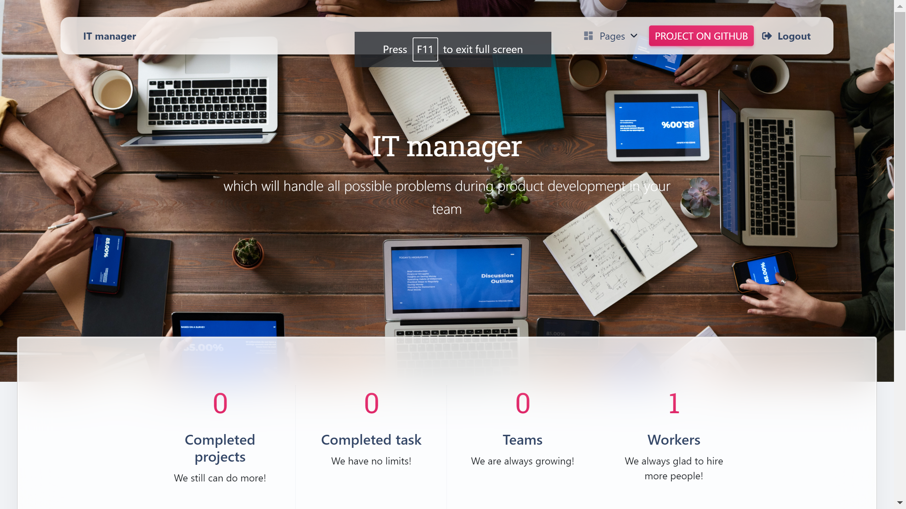

# IT company task manager

A customizable Task Manager designed for your IT company's product development needs.Which will handle all possible problems during product development in your team. Everyone from the team can create Task, assign this Task to team-members, and mark the Task as done

## Installation

A quick introduction of the minimal setup you need to get

```shell
git clone https://github.com/OlehOryshchuk/IT-company-task-manager.git
cd it_company_task_manager
```
If you are using PyCharm - it may propose you to automatically create venv for your project and install requirements in it, but if not:

```shell
python -m venv venv
venv\Scripts\activate (on Windows)
source venv/bin/activate (on macOS)
pip install -r requirements.txt
python manage.py migrate
python manage.py runserver
```
### Deployed

## Features

* Authentication functionality for Worker/User.
* Managing workers, teams, projects, tasks directly from website interface.
* Create position only through admin panel.
* Create task type you can through website interface.
* We can tag projects and tasks , thanks to `django-taggit` package.
* Using `django-taggit-autosuggest` that provides auto-suggesting when we typing in input field creatig user-friendly interface if it wasn't found it will create the typed tag.
* Search bars to find tasks, projects, workers, teams, positions.
* We can filter tasks by `task-type`, `is_completed`, `tags` fields. 
* To be able to work on task you need to work in teams that work on task project.
* Only owner can update and delete task, project, team.
* When you create task, project, team you are owner of it.
* You can assign task only to your team members.
* You can't set deadline for task and project in past.
* On project detail page you can click link to see all teams that are working on project
* On team detail page you can click link to see all team projects and team members and you can join and leave the team

## DB-structure diagram:

[DB-structure diagram](/static/assets/img/db-diagram.png)
## Demo

Superuser (or create another one by yourself: `python manage.py createsuperuser`):
- Name: Admin
- Password: P@ssw023!

You need to create your `.env` file and register your variables in it. After that, everything will work. For an example, see the file `.env_example`

Home page:

## Links

- Repository: https://github.com/OlehOryshchuk/IT-company-task-manager
- django-taggit: https://www.geeksforgeeks.org/adding-tags-using-django-taggit-in-django-project/
- django-taggit-autosuggest: https://github.com/iarp/django-taggit-autosuggest


